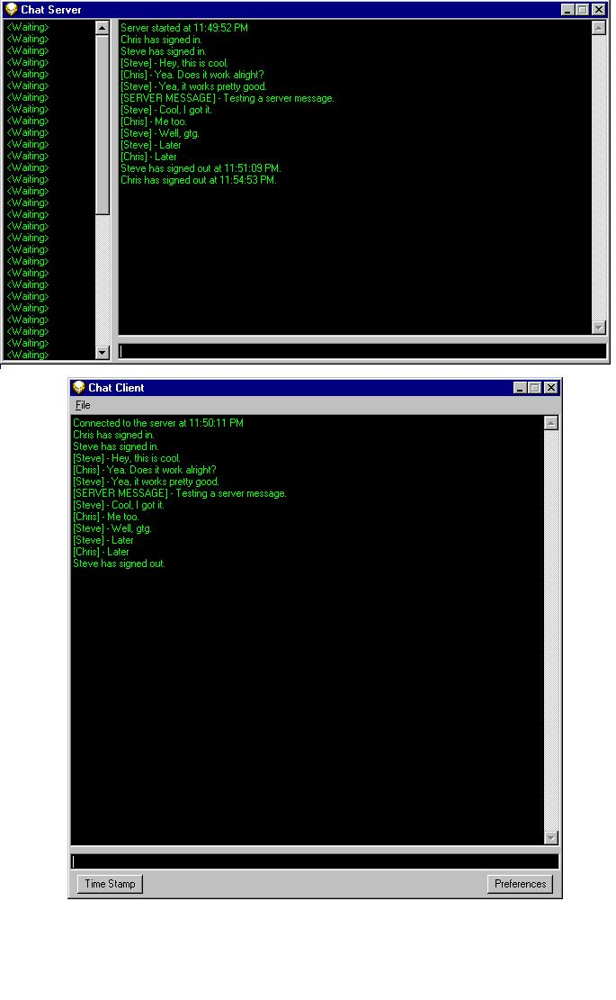



## Chat using winsock

### Description

This is a basic chat program using winsock. It demonstrates how to accept multiple connections, how to use a delimeter to separate incoming messages. It shows how to accept connections, send and receive messages, etc. with winsock. This should help you people that are new with winsock.
 
### More Info
 

             |
---                |---
**Submitted On**   |2001-04-14 23:47:28
**By**             |[Christopher Maze](https://github.com/Planet-Source-Code/PSCIndex/blob/master/ByAuthor/christopher-maze.md)
**Level**          |Beginner
**User Rating**    |4.9 (49 globes from 10 users)
**Compatibility**  |VB 6\.0
**Category**       |[Internet/ HTML](https://github.com/Planet-Source-Code/PSCIndex/blob/master/ByCategory/internet-html__1-34.md)
**World**          |[Visual Basic](https://github.com/Planet-Source-Code/PSCIndex/blob/master/ByWorld/visual-basic.md)
**Archive File**   |[Chat using183994152001\.zip](https://github.com/Planet-Source-Code/christopher-maze-chat-using-winsock__1-22418/archive/master.zip)

